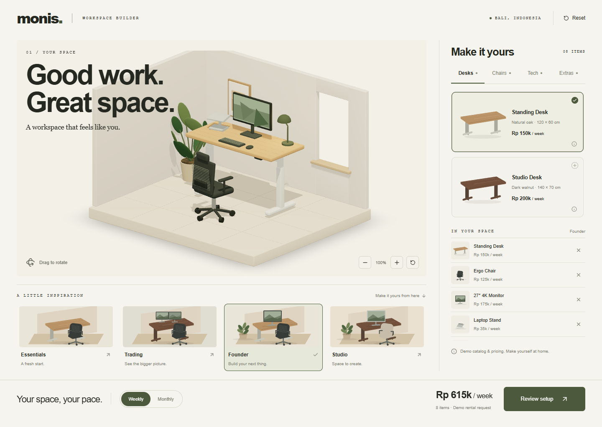

# Monis Workspace Builder

Developed by Kelvin Sukhiraja.

An interactive workspace configurator for the Monis coding challenge. Start with an empty room, choose furniture and accessories, and preview a rental request. The MVP includes two desks, two chairs, three monitor configurations and four editable templates.



## Approach

I used AI as a planning and development partner, starting with the application flow, scope and technical choices. We explored two visual concepts and chose a warm architectural room with bold typography and olive accents. The aim was to make choosing office equipment feel closer to a character customization screen than a product catalog.

The plan was to agree on the design first, build a functioning prototype to validate the logic, then apply and refine the interface. Keeping configuration and pricing separate from the 3D scene made it easier to adjust individual features without rebuilding the experience. The current MVP follows that direction with procedural furniture; detailed models and materials remain an opportunity for further refinement.

## Technology

Next.js and TypeScript provide the application structure and strict type checking. Tailwind CSS and custom CSS handle the responsive interface. React Three Fiber and Drei render the room, with rendering paused while the scene is idle. A shared reducer keeps the preview, catalog and checkout consistent, and validated browser storage restores the setup after a refresh.

## Run locally

Use Node.js 22 or later and npm. The repository includes a lockfile for reproducible installation.

```sh
npm ci
npm run dev
```

Open [localhost:3000](http://127.0.0.1:3000). For a production preview, run `npm run build` followed by `npm start`.

## Checks

```sh
npm run format:check
npm run typecheck
npm test
npm run build
npx playwright install chromium
npm run test:e2e
```

Browser tests start the application automatically. They cover customization, pricing, saved selections, keyboard navigation, mobile checkout and the demo request. GitHub Actions runs the same checks. Set `PLAYWRIGHT_CHANNEL=msedge` to use an installed Edge browser instead of the bundled Chromium browser.

## Scope

Prices and inventory are illustrative. The request form demonstrates the flow without sending contact details, reserving equipment or taking payment. Only the selected products and rental period are stored on the device. Furniture has fixed placement, and a desk and chair are required to complete this workspace flow.

## With more time

1. Allow furniture to be moved and rotated, with snapping and collision checks to keep layouts usable.
2. Replace procedural furniture with optimized product models, better materials and more natural lighting.
3. Expand the room editor with dimensions, wall finishes and a choice of lighting conditions.
4. Add shareable setups and saved alternatives so users can compare arrangements.
5. Connect verified inventory, delivery availability and pricing to a real rental service, then measure performance on physical mobile devices.

The [design plan](docs/PLAN.md) and [validation notes](docs/VALIDATION.md) provide further context.
